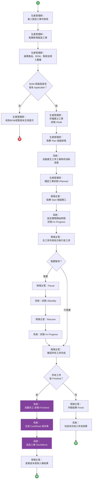
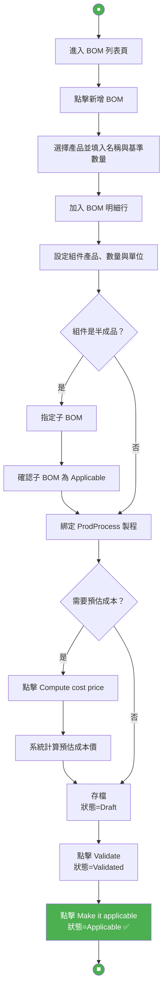
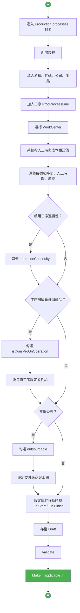
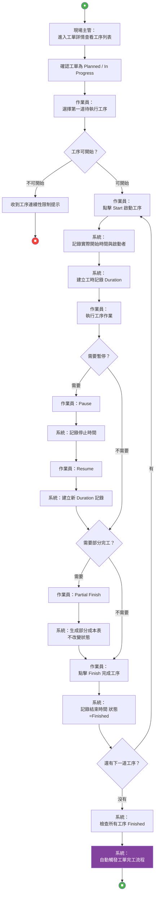
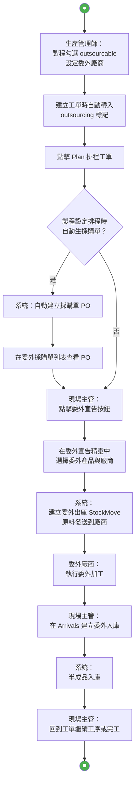

# MES 活動圖 Mermaid 版本

> 以下為 `activities/*.activity` 的 Mermaid 渲染版，方便直接在 Markdown 預覽器中查看。

---

## 01-製造工單完整生命週期

角色：生產管理師、現場主管、系統

---

## 02-BOM 建立與審核

角色：生產管理師、系統

---

## 03-生產製程建立

角色：生產管理師、系統

---

## 04-工序執行流程

角色：作業員、現場主管、系統

---

## 05-委外流程

角色：生產管理師、現場主管、系統、委外廠商

