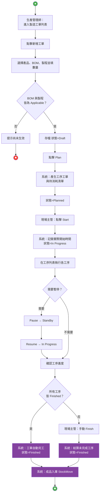
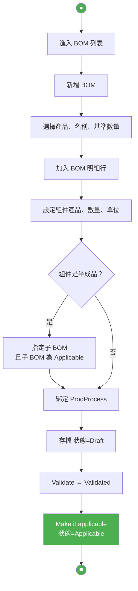
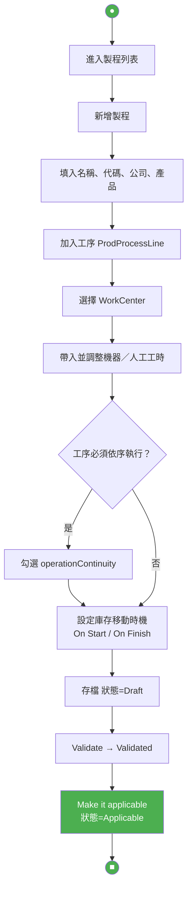
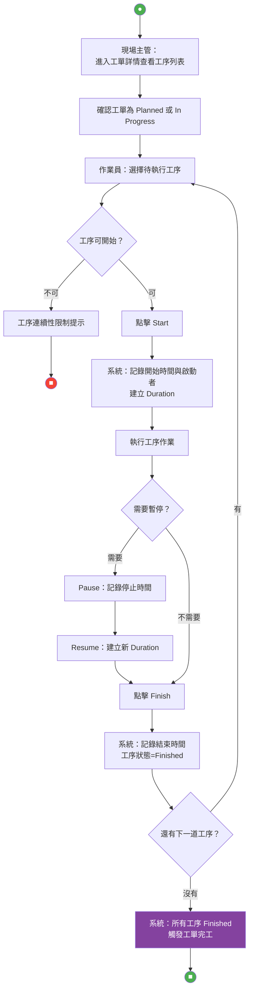

# MES 必要流程活動圖（P0）

對應 `docs/mes-schema-slim.dbml`。完整五條見 `docs/Activity-Diagrams-Mermaid.md`。

本檔只保留走通工單生命週期的四條 user flow：BOM → 製程 → 開工單 → 執行工序 → 完工入庫。

拿掉：委外（UF-05）、CostSheet、工序 Partial Finish、製程層消耗品／委外設定、BOM 預估成本。

主路徑：

```
Applicable BOM + Applicable 製程
  → 建立工單 Draft
  → Plan（產生工序與待消耗）
  → Start
  → 工序 Start / Pause / Resume / Finish
  → 工單 Finished + 成品入庫
```

---

## 01-製造工單生命週期

角色：生產管理師、現場主管、系統



---

## 02-BOM 建立與審核

角色：生產管理師、系統



---

## 03-生產製程建立

角色：生產管理師、系統



---

## 04-工序執行

角色：作業員、現場主管、系統


