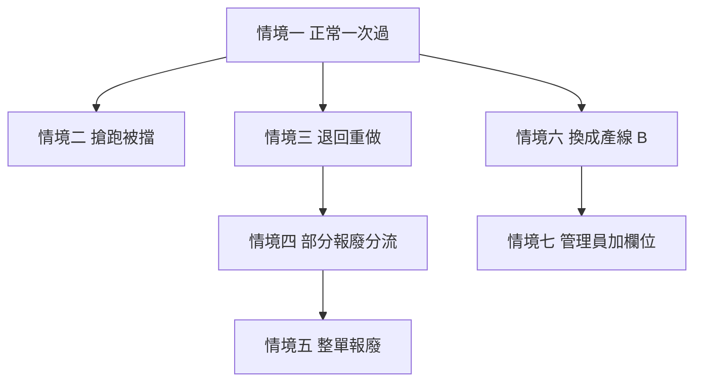
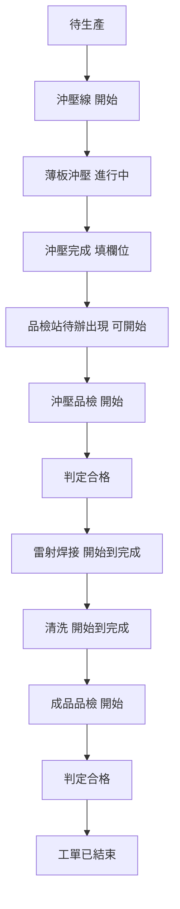
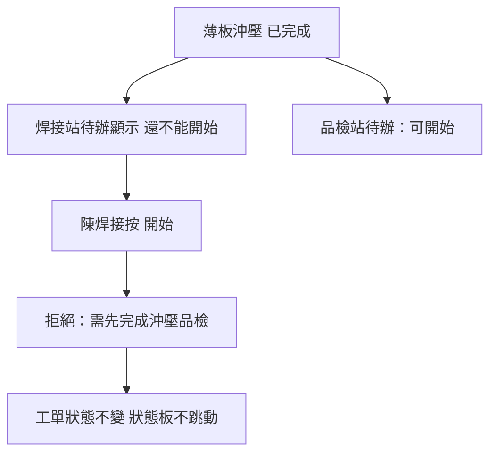
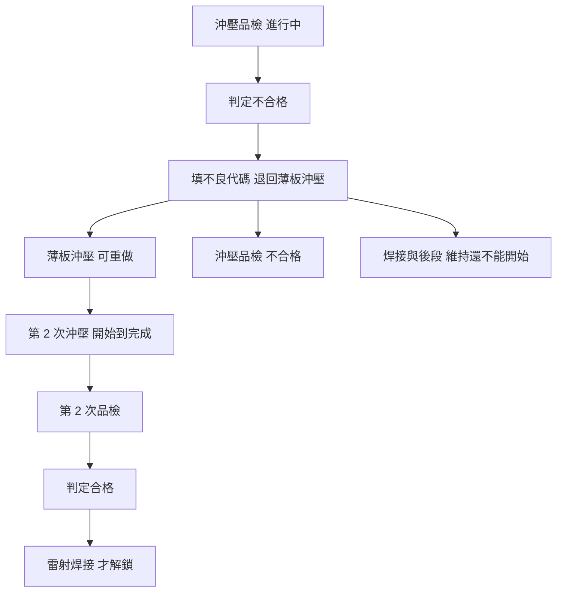
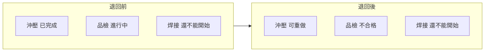
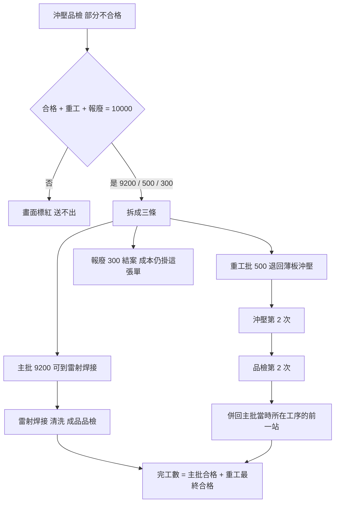
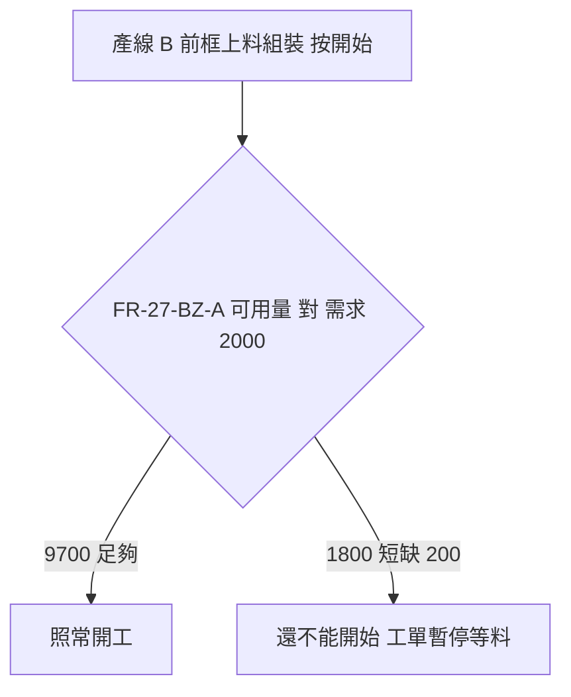
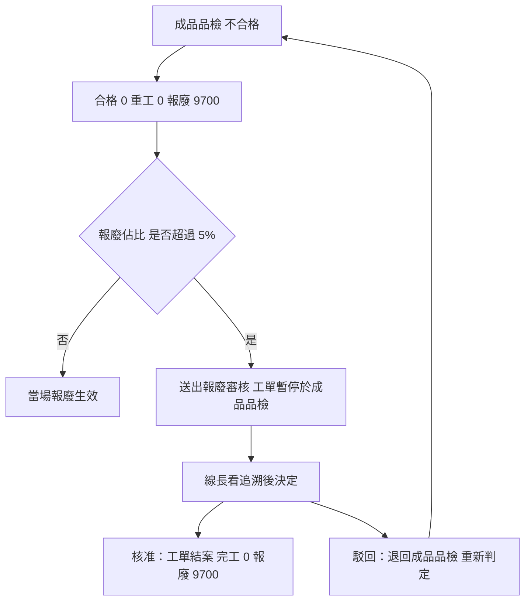
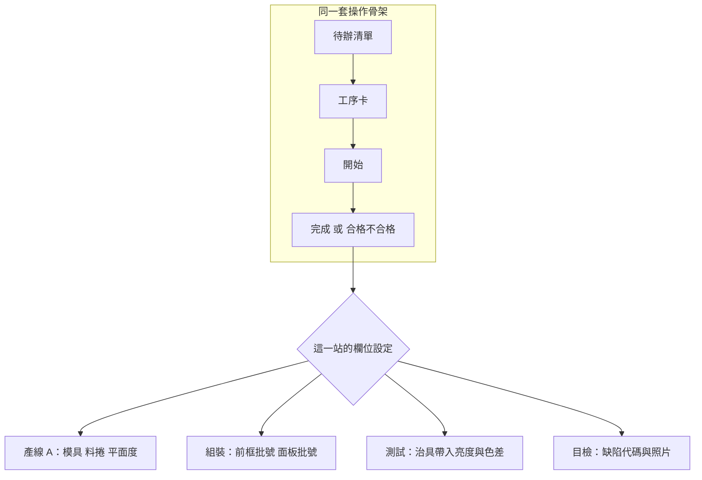
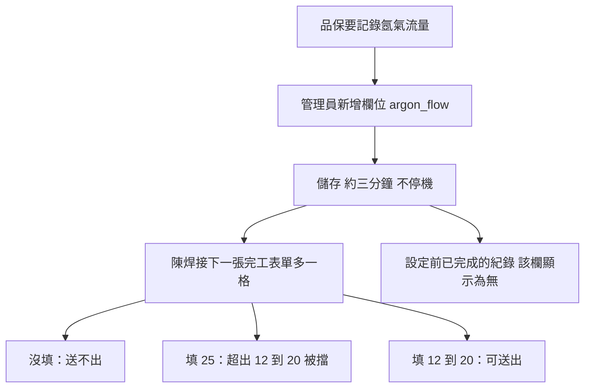

# 現場執行規格：情境流程

對應 `spec.md` 第 2 到第 8 章。每張圖只畫會改變工單或畫面的步驟。

---

## 總覽

七個情境不是七條互不相關的路。前五條都在產線 A 的同一張單上分岔，第六條換產線證明骨架可重用，第七條證明欄位可設定。

---

## 情境一：正常一次過

王沖壓開工到成品品檢合格。單會自己推到下一站待辦，沒有人需要通知下一個站。

---

## 情境二：搶跑被擋

沖壓剛完、品檢還沒做。陳焊接在焊接站按開始。系統拒絕，工單狀態不變。

---

## 情境三：品檢不合格，退回重做

退回不覆蓋原紀錄。後段站從頭到尾沒被解鎖過。

退回當下各站：

---

## 情境四：部分報廢分流

合格 + 重工 + 報廢必須等於送檢數。主批不需要等重工批。

若報廢大到前框只剩 1800，產線 B 第一站會被擋：

---

## 情境五：整單報廢

報廢佔比超過門檻（預設 5%）走線長審核，不直接結案。

---

## 情境六：產線 B

操作骨架相同，完成後的表單不同。系統沒有為金屬沖壓寫死欄位。

---

## 情境七：管理員動態新增欄位

設定寫入製程定義，下一張焊接完工表單立刻出現新欄。已完成的紀錄不會被追認為缺漏。

